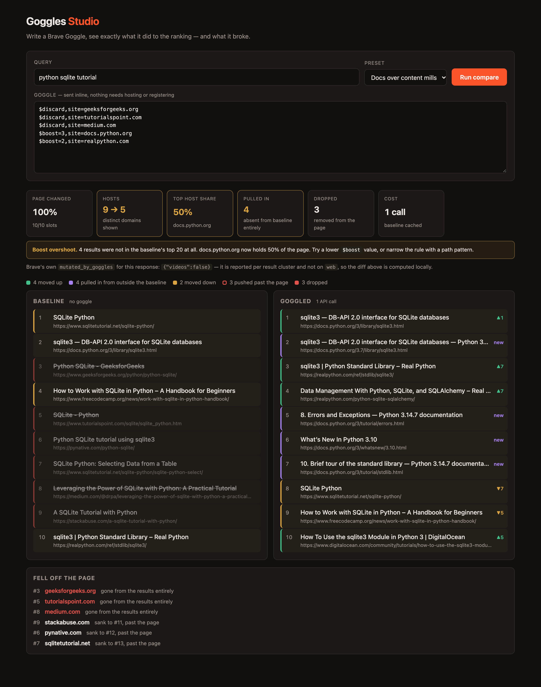

# Goggles Studio

A workbench for authoring [Brave Search Goggles](https://brave.com/goggles). Write a
Goggle, run it against a live query, and see exactly what it did to the ranking —
including the part that is easy to miss: what it broke.



## Why

Goggles are the most distinctive thing in the Brave Search API. They let a caller
re-rank Brave's index at query time — boost sources, bury SEO farms, or carve out a
focused vertical search — which is a lever no other major search API hands you.

Tuning one is the hard part. From Brave's own
[getting-started guide](https://github.com/brave/goggles-quickstart/blob/main/getting-started.md#fine-tuning-a-goggle):

> The typical flow is to create the first set of instructions and then have a test
> set to evaluate the effect it has on the ranking. You will probably see some odd
> results and further instructions will be needed. **Rinse and repeat is the name of
> the game.**

Today that loop is eyeballing two tabs. There is no diff, no measurement, and no
signal when a rule quietly makes results worse. This fills that gap.

## Quick start

```bash
cp .env.example .env.local     # add your key from https://api.search.brave.com
npm install
npm run dev                    # API on :8787, UI on :5173
```

Open http://localhost:5173, pick a preset, hit **Run compare**.

## What it measures

Each run fetches 20 results with and without the Goggle, shows the top 10 of each,
and classifies every result:

| Class | Meaning |
|---|---|
| `promoted` / `demoted` | Present in both rankings; moved up or down |
| `dropped` | Was on the baseline page, now absent from the results entirely |
| `pushedOut` | Still in the results, but sank past the visible page |
| `pulledIn` | **Not in the baseline's top 20 at all** — the Goggle reached outside it |

`pulledIn` is the interesting one. A `$boost` that is too strong doesn't just reorder
the page; it drags in pages that were never relevant. The screenshot above shows
`$boost=3,site=docs.python.org` on the query *"python sqlite tutorial"* pulling in
*"Errors and Exceptions"*, *"What's New In Python 3.10"* and *"Brief tour of the
standard library"* — three results about neither SQLite nor tutorials, occupying half
the page.

Two metrics make that legible without reading a single result:

- **Top host share** — one host holding ≥40% of the page usually means a boost overshot
- **Hosts** — distinct domains before vs. after; a collapse means the Goggle traded
  diversity for control

Running the three shipped presets through it points at one conclusion:

| Goggle | Page changed | Hosts | Top host share | Pulled in |
|---|---|---|---|---|
| single `$discard` | 50% | 9 → 9 | 20% | 0 |
| three `$downrank` rules | 60% | 9 → **10** | 10% | 0 |
| three `$discard` + two `$boost` | 100% | 9 → **5** | 50% | **4** |

**`$boost` is the instruction that does collateral damage.** `$discard` and
`$downrank` reorder the page while leaving host diversity intact or slightly better —
they only ever remove or demote things you named. A `$boost` promotes an entire host,
so it reaches past the results you wanted into everything else that host publishes.
A bare `$boost=2` on one domain was enough to hand it 80% of a page.

That is not obvious from the syntax, where all three read like symmetric knobs.

## Design

```
src/lib/diff.ts       pure ranking diff — no network, no DOM, fully unit tested
src/lib/brave.ts      Brave API client; GET, switching to POST for long Goggles
src/server/app.ts     the Hono API, with storage and guards injected
src/server/ports.ts   interfaces the two runtimes implement differently
src/server/budget.ts  soft daily cap on API spend
src/server/index.ts   Node entrypoint  — in-memory cache, no guards
src/worker.ts         Worker entrypoint — Cache API, rate limit, budget, SPA
src/ui/               React studio
```

The API is a factory taking its dependencies as arguments, so the same routes run
under Node locally and on Cloudflare in production with different storage behind
them. `ports.ts` is the seam.

Three decisions worth calling out:

**Fetch 20, display 10.** With an equal-width window, a result promoted from #11 to #3
is indistinguishable from one the Goggle invented. The wider fetch is what makes
`pulledIn` mean something.

**The baseline is cached; nothing runs on keystroke.** Tuning a Goggle means running
the same query against an unchanging baseline dozens of times. Caching it by
`(query, count, country)` makes each iteration cost one API call instead of two, and
runs are fired by a button rather than a debounce — the free plan is $5/1k calls at
~1–2 requests/second, and a live-preview textarea would drain it in an afternoon.
Requests are also serialised through a 600ms throttle, since a compare fires two calls
back to back.

**The diff is pure and tested against recorded responses.** `test/fixtures/` holds real
20-result Brave payloads, so the classifier is verified against live data shapes
without spending calls on every test run.

## Two things learned from the live API

**1. `mutated_by_goggles` is not a reliable "did my Goggle fire" signal.** It is
reported per result cluster, and in practice appears on `videos` but not on `web`. A
goggled web response and an ungoggled one were indistinguishable by that flag — both
reported `{"videos": false}`. The studio surfaces whatever Brave returns, then computes
the real diff locally.

**2. Both GET and POST accept Goggles, with different shapes.** GET takes the Goggle as
a single url-encoded newline-separated string; POST takes `goggles` as a JSON array.
The client uses GET and switches to POST past ~1500 characters, since a large Goggle
otherwise risks request-URL length limits.

## Deploying to Cloudflare

One Worker serves both the built SPA and the API from the same origin.

```bash
wrangler login
wrangler kv namespace create BUDGET      # paste the returned id into wrangler.jsonc
wrangler secret put BRAVE_SEARCH_API_KEY # never in config or git
npm run deploy
```

`npm run preview` runs the same Worker locally against `workerd` first. It reads the
key from `.dev.vars` rather than `.env.local` — Wrangler's own convention, gitignored
alongside it:

```bash
cp .env.local .dev.vars
```

A public deployment spends **your** Brave credits, and that is the binding
constraint — not Cloudflare. The Workers free tier is 100k requests/day; a Brave
free tier is roughly 1,000 calls/month at $5/1k, and a compare costs one or two.
So the Worker adds two guards the Node server does not have:

| Guard | Where | Effect |
|---|---|---|
| Per-IP burst limit | `ratelimits` binding | 10 compares/minute, then a 429 |
| Daily spend cap | `DAILY_CALL_CAP` + KV | 200 Brave calls/UTC day, then a friendly 503 |

Both refuse *before* any Brave call is made, so a hammered deployment costs nothing.

The Worker also **fails closed**: if the `BUDGET` KV binding is missing, `/api/compare`
returns a 503 rather than running without a cap. Skipping the KV step cannot
accidentally ship an uncapped public deployment.

Two things worth knowing if you copy this setup:

- **The rate-limit binding only accepts a `period` of 10 or 60 seconds.** Longer
  windows are not expressible, so it works as a burst guard and the daily KV counter
  does the actual spend protection.
- **Baselines move from a `Map` to the Cache API.** Workers isolates are ephemeral and
  per-colo, so in-process caching loses the baseline constantly — which would quietly
  double the API cost of every iteration. Measured on the deployed Worker: a cold run
  is 2 calls / ~1500ms, the next run on the same query is 1 call / ~430ms.

The KV counter is eventually consistent, so concurrent bursts can overshoot the cap
slightly. That is deliberate — the job is preventing a runaway bill, not exact
accounting.

## Tests

```bash
npm test          # 25 tests
npm run build     # typecheck + production build
npm run shot      # regenerate docs/screenshot.png (needs `npm run dev` running)
```

The diff engine is covered for rank deltas, discards, the `pushedOut`/`dropped`
distinction, host concentration, and empty-result edge cases; the cache, throttle and
daily budget are tested with an injected clock. `npm run shot` doubles as a smoke test — it fails on
any console error.

## Next

- Save a query set and score a Goggle across all of it, not one query at a time
- Diff two Goggles against each other, not just against the baseline
- Generate a starting Goggle from a plain-English description of the intent
- Apply the same diff to the `llm/context` endpoint, where the Goggle decides what
  grounds an LLM answer
