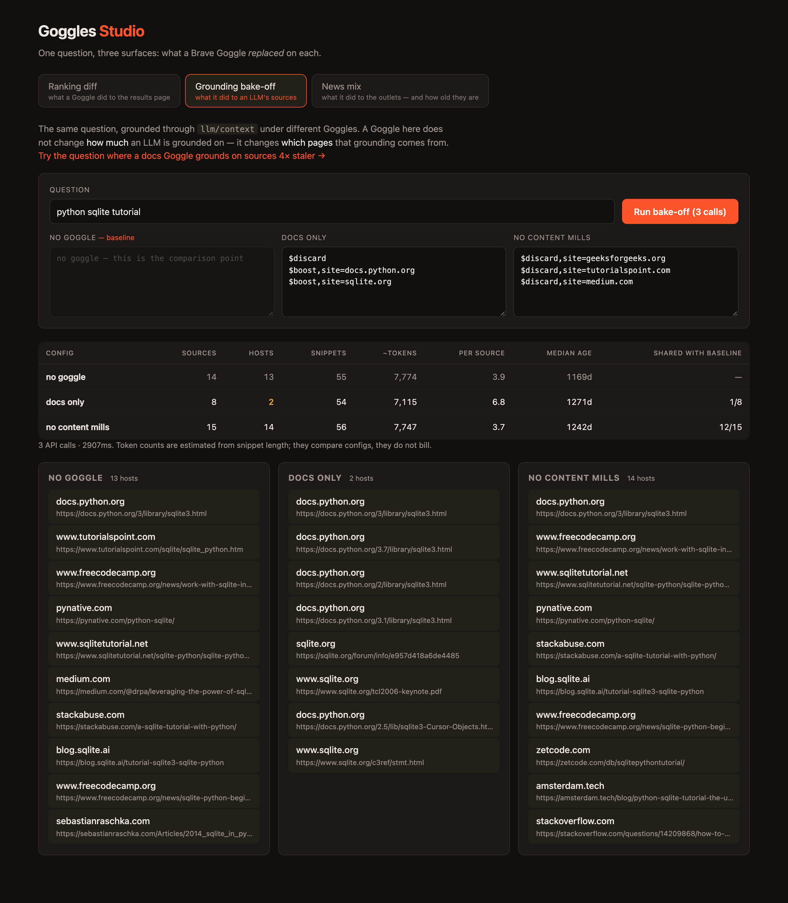
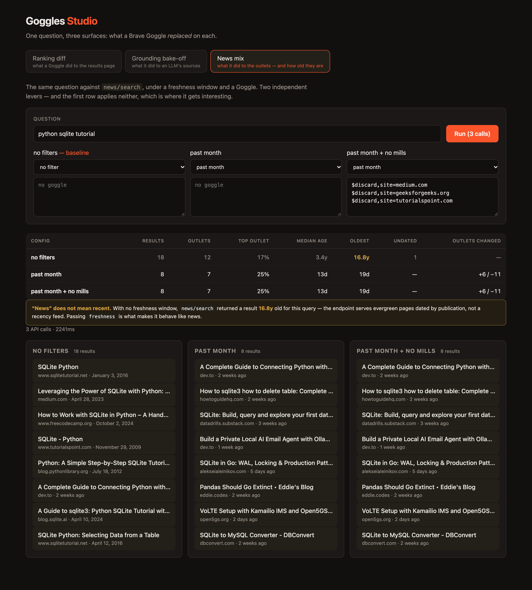

# Goggles Studio

[](https://github.com/jonaddams/goggles-studio/actions/workflows/ci.yml)

A workbench for authoring [Brave Search Goggles](https://brave.com/goggles). One
question, three surfaces, one recurring inquiry: **what did this Goggle replace?**

- **Ranking diff** — what it did to the results page
- **Grounding bake-off** — what it did to the sources an LLM gets grounded on
- **News mix** — what it did to the outlets, and how old they actually are

Goggles apply to `web/search`, `llm/context` and `news/search` — not to the local,
image, video, suggest, spellcheck or answers endpoints.

**Live: [goggles-studio.jonaddams.workers.dev](https://goggles-studio.jonaddams.workers.dev)**


## Why

Goggles are the most distinctive thing in the Brave Search API. They let a caller
re-rank Brave's index at query time — boost sources, bury SEO farms, or carve out a
focused vertical search — which is a lever no other major search API hands you.

Tuning one is the hard part. From Brave's own
[getting-started guide](https://github.com/brave/goggles-quickstart/blob/main/getting-started.md#fine-tuning-a-goggle):

> The typical flow is to create the first set of instructions and then have a test
> set to evaluate the effect it has on the ranking. You will probably see some odd
> results and further instructions will be needed. **Rinse and repeat is the name of
> the game.**

Today that loop is eyeballing two tabs. There is no diff, no measurement, and no
signal when a rule quietly makes results worse. This fills that gap.

## Quick start

```bash
cp .env.example .env.local     # add your key from https://api.search.brave.com
npm install
npm run dev                    # API on :8787, UI on :5173
```

Open http://localhost:5173, pick a preset, hit **Run compare**.

## What it measures

Each run fetches 20 results with and without the Goggle, shows the top 10 of each,
and classifies every result:

| Class | Meaning |
|---|---|
| `promoted` / `demoted` | Present in both rankings; moved up or down |
| `dropped` | Was on the baseline page, now absent from the results entirely |
| `pushedOut` | Still in the results, but sank past the visible page |
| `pulledIn` | **Not in the baseline's top 20 at all** — the Goggle reached outside it |

`pulledIn` is the interesting one. A `$boost` that is too strong doesn't just reorder
the page; it drags in pages that were never relevant. The screenshot above shows
`$boost=3,site=docs.python.org` on the query *"python sqlite tutorial"* pulling in
*"Errors and Exceptions"*, *"What's New In Python 3.10"* and *"Brief tour of the
standard library"* — three results about neither SQLite nor tutorials, occupying half
the page.

Two metrics make that legible without reading a single result:

- **Top host share** — one host holding ≥40% of the page usually means a boost overshot
- **Hosts** — distinct domains before vs. after; a collapse means the Goggle traded
  diversity for control

Running the three shipped presets through it points at one conclusion:

| Goggle | Page changed | Hosts | Top host share | Pulled in |
|---|---|---|---|---|
| single `$discard` | 50% | 9 → 9 | 20% | 0 |
| three `$downrank` rules | 60% | 9 → **10** | 10% | 0 |
| three `$discard` + two `$boost` | 100% | 9 → **5** | 50% | **4** |

**`$boost` is the instruction that does collateral damage.** `$discard` and
`$downrank` reorder the page while leaving host diversity intact or slightly better —
they only ever remove or demote things you named. A `$boost` promotes an entire host,
so it reaches past the results you wanted into everything else that host publishes.
A bare `$boost=2` on one domain was enough to hand it 80% of a page.

That is not obvious from the syntax, where all three read like symmetric knobs.

## Grounding bake-off



The second tab runs the **same question** through `llm/context` under several Goggles
and compares the grounding sets. Both tabs share one query deliberately — the point is
to change the lens, not the subject.

**A Goggle does not make grounding cheaper — it changes who fills the budget.**

| Goggle | Sources | Hosts | ~Tokens | Snippets/source | Shared with baseline |
|---|---|---|---|---|---|
| none | 14 | 13 | 7,774 | 3.9 | — |
| docs only | 8 | **2** | 7,199 | **6.9** | **1/8** |
| no content mills | 15 | 14 | 7,822 | 3.7 | 12/15 |

The token volume barely moves. What moves is composition: `docs only` shares a single
source with the baseline and collapses 13 hosts to 2, while packing nearly twice as
many snippets into each surviving source. A targeted `$discard` keeps 12 of 15 and
*raises* host count.

And the overshoot from the ranking tab reappears here, one layer down. Of the 8 sources
`docs only` grounds on, five are the same `sqlite3` page at different Python versions —
`/3/`, `/3.7/`, `/2/`, `/3.1/`, `/2.5/` — alongside `sqlite.org/tcl2006-keynote.pdf`, a
Tcl conference keynote from 2006. `$boost` promotes a whole host, so it reaches past
the page you wanted into that host's archives.

**Authority is not freshness.** On a faster-moving question the gap is starker. The
in-app link loads *"rust async runtime tokio vs async-std"*, where boosting
`doc.rust-lang.org`, `docs.rs` and `tokio.rs` grounds on sources with a median age of
**2,476 days** against the baseline's 630 — four times staler for the same token
volume, including a 2019 alpha announcement and an unrelated OAuth crate. The sources
look more authoritative and are substantially worse for the question, and nothing in
the response says so.

## News mix



The third tab runs the same question against `news/search` under two independent
levers: a freshness window and a Goggle.

**"News" does not mean recent.** With no `freshness` parameter, the endpoint returned
18 results for *"python sqlite tutorial"* whose median age was **3.4 years** and whose
oldest was **16.8 years** — a tutorial page published in November 2009, served as news.
The endpoint is not a recency feed; it searches the news index and dates results by
publication. Passing `freshness` is what makes it behave the way the name implies.

| Config | Results | Outlets | Median age | Oldest | Outlets changed |
|---|---|---|---|---|---|
| no filters | 18 | 12 | 3.4y | **16.8y** | — |
| past month | 8 | 7 | 13d | 19d | +6 / −11 |
| past month + no mills | 9 | 8 | 14d | 19d | +6 / −10 |

Freshness is the lever that costs you volume — 18 results down to 8. The Goggle then
reshapes what remains without costing much: adding three `$discard` rules on top of the
month window *raised* the result count to 9 and the outlet count to 8, by displacing
mill content that was crowding out smaller publishers.

That is the third variation on the same theme. A Goggle never changes how much you get
back — it changes who is in it.

## Design

```
src/lib/diff.ts       pure ranking diff — no network, no DOM, fully unit tested
src/lib/grounding.ts  pure grounding-set metrics; shares hostOf with diff.ts
src/lib/news.ts       pure news-mix metrics: outlets, concentration, recency
src/lib/brave.ts      Brave API client; GET, switching to POST for long Goggles
src/server/app.ts     the Hono API, with storage and guards injected
src/server/ports.ts   interfaces the two runtimes implement differently
src/server/budget.ts  soft daily cap on API spend
src/server/index.ts   Node entrypoint  — in-memory cache, no guards
src/worker.ts         Worker entrypoint — Cache API, rate limit, budget, SPA
src/ui/               React studio, three tabs
```

The API is a factory taking its dependencies as arguments, so the same routes run
under Node locally and on Cloudflare in production with different storage behind
them. `ports.ts` is the seam.

Three decisions worth calling out:

**Fetch 20, display 10.** With an equal-width window, a result promoted from #11 to #3
is indistinguishable from one the Goggle invented. The wider fetch is what makes
`pulledIn` mean something.

**The baseline is cached; nothing runs on keystroke.** Tuning a Goggle means running
the same query against an unchanging baseline dozens of times. Caching it by
`(query, count, country)` makes each iteration cost one API call instead of two, and
runs are fired by a button rather than a debounce — the free plan is $5/1k calls at
~1–2 requests/second, and a live-preview textarea would drain it in an afternoon.
Requests are also serialised through a 600ms throttle, since a compare fires two calls
back to back.

**The diff is pure and tested against recorded responses.** `test/fixtures/` holds real
20-result Brave payloads, so the classifier is verified against live data shapes
without spending calls on every test run.

## Four things learned from the live API

**1. `mutated_by_goggles` is not a reliable "did my Goggle fire" signal.** It is
reported per result cluster, and in practice appears on `videos` but not on `web`. A
goggled web response and an ungoggled one were indistinguishable by that flag — both
reported `{"videos": false}`. The studio surfaces whatever Brave returns, then computes
the real diff locally.

**2. `max_tokens` did not bound the grounding returned by `llm/context`.** Sending
`max_tokens=2048`, `max_tokens=16384`, and omitting it entirely all produced roughly
8,030 estimated tokens from 18 sources for the same query, on both GET and POST.
`count` is what governs volume. Token counts here are estimated from snippet length,
but a 8x difference in the requested cap producing identical output is hard to explain
as estimation error.

**3. `news/search` without `freshness` is not a news feed.** It returned a page from
November 2009 as a news result. Anything grounding an assistant on "the news" without
passing a freshness window is not getting news.

**4. Both GET and POST accept Goggles, with different shapes.** GET takes the Goggle as
a single url-encoded newline-separated string; POST takes `goggles` as a JSON array.
The client uses GET and switches to POST past ~1500 characters, since a large Goggle
otherwise risks request-URL length limits.

## Deploying to Cloudflare

One Worker serves both the built SPA and the API from the same origin.

```bash
npx wrangler login
npx wrangler kv namespace create BUDGET      # paste the returned id into wrangler.jsonc
npx wrangler secret put BRAVE_SEARCH_API_KEY # never in config or git
npm run deploy
```

Wrangler has no Homebrew formula; it ships through npm, and is pinned here as a
devDependency so deploys use the version this repo was tested against.

`npm run preview` runs the same Worker locally against `workerd` first. It reads the
key from `.dev.vars` rather than `.env.local` — Wrangler's own convention, gitignored
alongside it:

```bash
cp .env.local .dev.vars
```

A public deployment spends **your** Brave credits, and that is the binding
constraint — not Cloudflare. The Workers free tier is 100k requests/day; a Brave
free tier is roughly 1,000 calls/month at $5/1k, and a compare costs one or two.
So the Worker adds two guards the Node server does not have:

| Guard | Where | Effect |
|---|---|---|
| Per-IP burst limit | `ratelimits` binding | 10 compares/minute, then a 429 |
| Daily spend cap | `DAILY_CALL_CAP` + KV | 200 Brave calls/UTC day, then a friendly 503 |

Both refuse *before* any Brave call is made, so a hammered deployment costs nothing.

The Worker also **fails closed**: if the `BUDGET` KV binding is missing, `/api/compare`
returns a 503 rather than running without a cap. Skipping the KV step cannot
accidentally ship an uncapped public deployment.

Two things worth knowing if you copy this setup:

- **The rate-limit binding only accepts a `period` of 10 or 60 seconds.** Longer
  windows are not expressible, so it works as a burst guard and the daily KV counter
  does the actual spend protection.
- **Baselines move from a `Map` to the Cache API.** Workers isolates are ephemeral and
  per-colo, so in-process caching loses the baseline constantly — which would quietly
  double the API cost of every iteration. Measured on the deployed Worker: a cold run
  is 2 calls / ~1500ms, the next run on the same query is 1 call / ~430ms.

The KV counter is eventually consistent, so concurrent bursts can overshoot the cap
slightly. That is deliberate — the job is preventing a runaway bill, not exact
accounting.

## Tests

```bash
npm test          # 48 tests
npm run build     # typecheck + production build
npm run shot      # regenerate all three screenshots (needs `npm run dev` running)
```

CI runs the suite and both typechecks on every push. It needs no API key: the tests
run against recorded Brave responses in `test/fixtures`, so they spend no calls and
cannot flake on a live endpoint.

The diff engine is covered for rank deltas, discards, the `pushedOut`/`dropped`
distinction, host concentration, and empty-result edge cases; the cache, throttle and
daily budget are tested with an injected clock. The grounding metrics are covered for
source overlap, host concentration, snippet density, median freshness and empty
contexts, against recorded `llm/context` responses; the news metrics cover outlet
concentration, median and oldest recency, undated results and outlet churn, against
recorded `news/search` responses. `npm run shot` doubles as a smoke test — it fails on
any console error.

## Next

- Save a query set and score a Goggle across all of it, not one query at a time
- Diff two Goggles against each other, not just against the baseline
- Generate a starting Goggle from a plain-English description of the intent
- Score grounding freshness against the question's own volatility — a stale source is
  only a problem for a question whose answer moved
